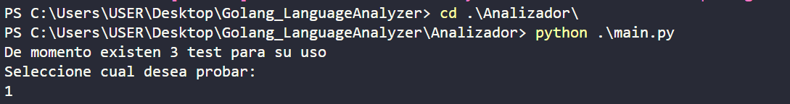

# Golang_LanguageAnalyzer

## Requisitos

- Python 3.7 o superior

## Analizador Léxico

El **analizador léxico** para el lenguaje de programación **Go** tiene como objetivo principal  leer y procesar archivos fuente escritos en Go, identificando y clasificando cada uno de los tokens presentes en el código, como palabras clave, identificadores, literales, operadores, y otros elementos léxicos propios del lenguaje.

## Características

- **Identificación de tokens**: El analizador es capaz de reconocer y categorizar diferentes tipos de tokens en el lenguaje Go.
- **Soporte para archivos de prueba**: El programa permite analizar archivos de prueba para verificar su correcto funcionamiento.

## Estructura del Proyecto
- `Analizador/main.py`  : Usa la libreria **ply** de Python para definir tokens, y expresiones regulares para los diferentes tokens. Procesa los archivos **.go**.
- `Analizador/leerGo.py`: Archivo principal para leer archivos de prueba y convertirlos en cadenas de texto que serán analizadas en el archivo **main.py**.
- `Analizador/logGo.py`: Genera archivos **.log** de los test realizados por distintos usuarios.
- `testeos/`: Carpeta que contiene archivos de prueba en Go que serán analizados por el sistema.

## Uso

1. Usa uno preexistente o coloca el archivo de prueba en la carpeta `testeos`. Siguiendo el formato `algoritmoXX.go`
   ejemplo: ***algoritmo1.go*** , ***algoritmo10.go***
2. Ejecuta el script `main.py` con el comando `python main.py`para analizar el archivo de prueba. (Debes asegurar estar en la carpeta `Analizador/`)

   

    Una vez dentro de la carpeta, si usas **vscode** puedes usar el botón de ejecutar.
   

3. El sistema mostrará en pantalla los tokens identificados y cualquier error léxico encontrado.

   

## Autores

- Desarrollado por [Alex Peñafiel].
- Desarrollado por [Ronald Gaibor].
- Desarrollado por [Daniel Villamar].

---